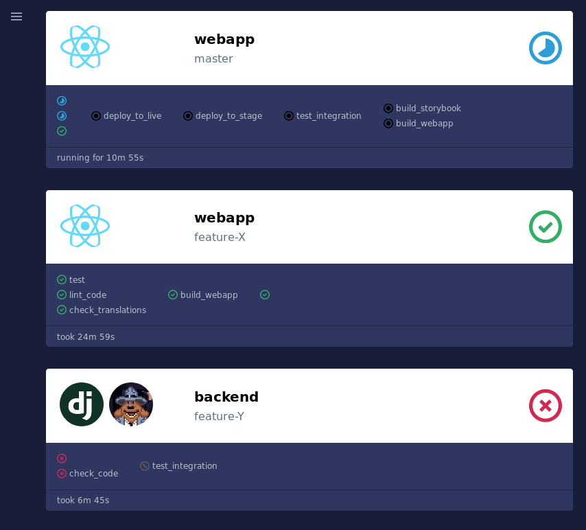

# gitlab-ci-status: a live overview of CI pipelines

## Motivation

When working together with multiple colleagues, sharing a single gitlab
runner (tool that runs your pipeline jobs) quickly led to some problems:

* my build is stuck, what is the runner doing?
* is my build done?

Especially stuck builds were annoying because we have to navigate through all
CI enabled projects on gitlab and check the pipeline status.

Some problems go away after you add concurrency / more runners, nevertheless
having a overview what's happening right now is useful sometimes.

## How does it work?

For each project you want to see in the overview, a new webhook has to be set
up that points to the instance of gitlab-ci-status. Updates are send for
pipeline and job events. A server persists the state on disk and the client
periodically fetches the state and renders it using React.

## Installation

TODO

## Ideas

* utilize SSE (server-side events) to only send updates to clients, not the
  whole state